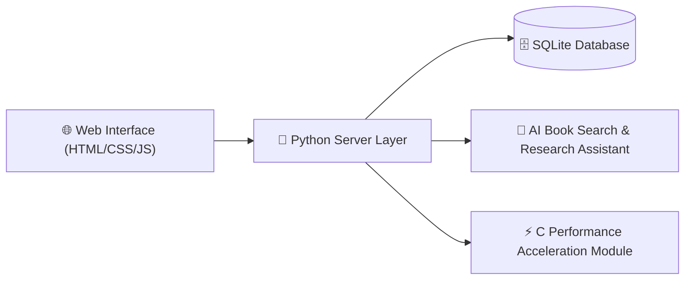

# 📚 Book Matrix — The Future of AI-Powered Library Management

<div align="center">

[](https://www.python.org/)
[](https://www.sqlite.org/)
[](https://developer.mozilla.org/)
[](https://en.wikipedia.org/wiki/C_(programming_language))
[](https://opensource.org/licenses/MIT)
[](https://www.linkedin.com/in/sriniwas-awasthi/)

**An intelligent, multi-language Library Management System built with Python, SQLite, HTML5/CSS3, and C acceleration, automating inventory management, circulation tracking, and AI research queries.**

</div>

---

## 📸 Real Application Screenshots

Below are screenshots captured directly from the live application, showcasing both Dark and Light visual themes as well as key functional modules:

### 1. 🌙 Home & Analytics Dashboard (Dark Theme)

*Executive overview interface in Dark Mode displaying key metrics, dynamic borrowing activity charts, popular books breakdown, and member distribution.*

---

### 2. ☀️ Home & Analytics Dashboard (Light Theme)

*Full system dashboard styled in Light Mode with high-contrast glassmorphic cards and crisp data visualizers.*

---

### 3. 📚 Book Catalog Management

*Complete inventory management view displaying titles, authors, categories, publishers, and real-time stock availability ratios.*

---

### 4. 👥 Member & User Directory

*User administration portal managing registered students, teachers, contact info, membership tiers, and borrowing privileges.*

---

### 5. 🔄 Issue & Return Circulation Terminal

*Real-time desk circulation panel for issuing books with return deadlines and processing check-ins with automated fine calculation.*

---

### 6. 🧠 AI Research & Inquiry Terminal

*Intelligent conversational AI assistant providing system guidance, instant book synopsis retrieval, and database interactions.*

---

### 7. 🔍 Natural Language AI Book Search

*AI assistant resolving conversational queries to fetch book metadata, ratings, pricing, and availability from SQLite.*

---

### 8. 📊 Historical Circulation Logs & Reports

*Comprehensive historical audit log tracking transaction IDs, member names, issue dates, due dates, and return statuses.*

---

### 9. ⚙️ System Settings & Administration

*Administrative control panel for managing security preferences, profile customization, and database backup operations.*

---

## 🌟 Core Highlights & Capabilities

- ⚡ **Automated Circulation**: Instant issue, return, and overdue fine calculation with real-time inventory adjustments.
- 🤖 **AI Research Assistant**: Natural language querying for book recommendations, synopsis generation, and citation lookups.
- 🚀 **C Performance Module**: Fast sorting and indexing routines compiled in C for handling massive bibliographic records.
- 🎨 **Adaptive Themes**: Seamless Dark and Light theme toggle with high-contrast accessibility.

---

## 🏛️ System Architecture



---

## 🛠️ Technology Stack & Algorithms

- **Backend**: Python 3.11, Built-in HTTP Engine, SQLite3 with B-Tree Indexing.
- **Frontend**: Responsive HTML5, CSS3 Custom Properties, Vanilla JavaScript (ES6+).
- **Core Algorithms**: Bubble Sort with Early Exit Flag ($O(N)$ Best Case), Regex Intent Parsing Engine, SuperMemo SM-2 Interval Logic.

---

## 🚀 Installation & Local Setup

```bash
# 1. Clone repository
git clone https://github.com/SriniwasAwasthi/book-matrix-lms.git
cd book-matrix-lms

# 2. Run the application
python server.py
```

Open your browser to the local development server address shown in your terminal.

---

## 📜 License

Distributed under the **MIT License**.

---

## 💖 Thank You for Visiting & Exploring Book Matrix!

> *"Thank you for taking the time to explore this project! Continuous learning, clean craftsmanship, and solving real-world challenges through elegant software are at the core of my developer journey."* 🚀

Whether you are a recruiter evaluating my software engineering capabilities or a fellow developer exploring the code, I am truly grateful for your visit.

* 🌟 **Found this project interesting?** Please consider giving this repository a **Star**!
* 📬 **Let's Connect & Collaborate:** I am actively seeking engineering internships and software roles.
  * 💻 **GitHub:** [@SriniwasAwasthi](https://github.com/SriniwasAwasthi)
  * 📧 **Email:** [sriawasthi164@gmail.com](mailto:sriawasthi164@gmail.com)
  * 🌐 **LinkedIn:** [sriniwas-awasthi](https://www.linkedin.com/in/sriniwas-awasthi/)

---
<div align="center">
  <sub>Designed & Crafted with Passion by <a href="https://github.com/SriniwasAwasthi"><strong>Sriniwas Awasthi</strong></a> • Computer Science Student & Software Engineer</sub>
</div>
